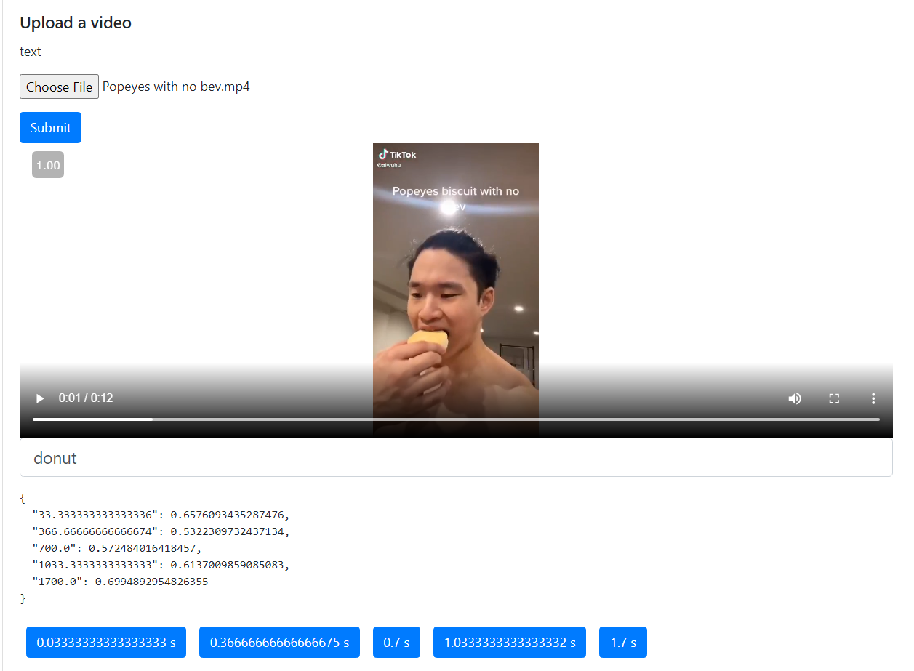

# videocontextsearch

This was a HackTheNorth2021 project soley done by myself. No team members unfortunately, but I'm pretty proud of being able to get something kind of done!

# What is this

A user can upload a video and search for frames by a text description of whatever is going on in the frame. 

For example, if there is a compilation video and it has a child riding a bicycle, we can search "a child riding a bicycle" and we'll get clickable timestamps returned.

# Demo

# How it's done

1. A video is sent through a post request to the Flask backend
2. OpenCV is used to split this video into an evenly-spaced subset of frames (hardcoded value of 0.3 percent of all the total frames at the moment)
3. An image-caption-repo is used to generate captions for all those frames
4. BERT is used to generate embeddings for all the image captions and the search query
5. A similarity comparison is done between the search query embedding and all the image captions
6. Timestamps with a similarity score of over 0.5 (0 to 1) are returned

# TODO

There is so much optimization, cleanup, and improvment to be done. Therefore, I won't even be merging this into main. 

* I'm going to make this much more cleaner, use a better methodology of searching for frames, implement a paper possibly (there were some really cool unsupervised clustering approaches predominately used in video summarization, highlight reel type of things), etc.
